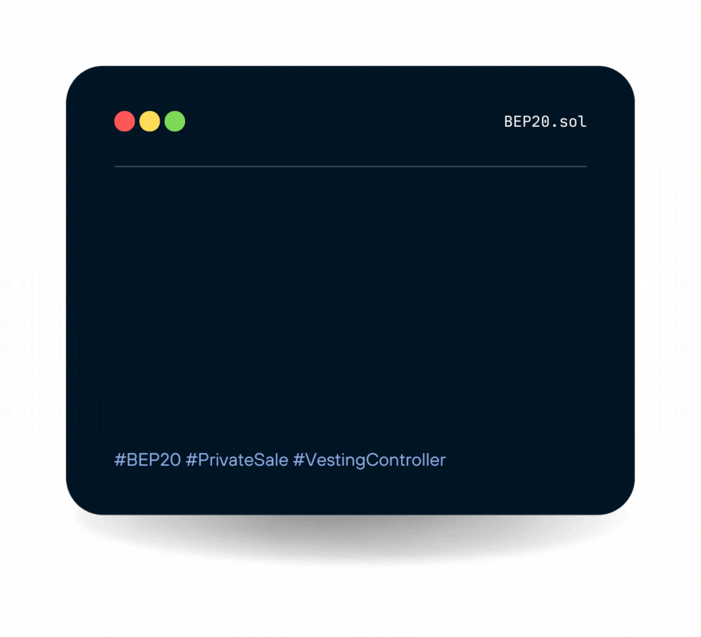

# Overview

### About this Documentation

A set of helpful software-building tools for blockchain based businesses makes integrating with customers much easier. Thorough this documentation we explain how our SDK works and what features you can expect in the future.

In the **Architecture** section we start by going over how to install and run the sample project included with the Share SDK, as well as key pieces you can tweak to start learning how it works and how it interacts with Hardhat and React.

Once you have the sample project running, in the **Share V1 SDK** section we present you with some tips and learning material to get you on the path of confidently developing blockchain projects and deploying them to your network of choice.

The **Build Features** section contains a lot of useful functionality, as well as details on the different features, helpers and components shipped with Share.

Wanna help Share grow? Is there some feature you'd like implemented? Did you run into a bug or did you solve one? Read the **Contributing to Share** section to learn how you can help.

Sharexchange.org is an exchange for the $Share presale. Learn more about it on the **Sharexchange.org** section.

If you are running into some issue, check the **Support** section to find out how to get some help or troubleshoot some common problems people usually run into.

### Recap of brief

> Sendable Receivable Interact with dapps // Pancakeswap metamask etc Lockable for Vesting Period Direct creation of max supply(no stacking, no mining e.g.) Lockable vesting Period explain: There will be a private sale. After the Private sale it should be possible for me to distribute the token thrue //send or smartcontract, but this token should be somehow or over a dapp or any idea what coming locked for a 1 year period. The 1 year locking period should be only for the private sale tokens. Maybe we could define a second wallet where the tokens when send from (not creating contract) the tokens will be locked for xy time amount.(Just a idea)
