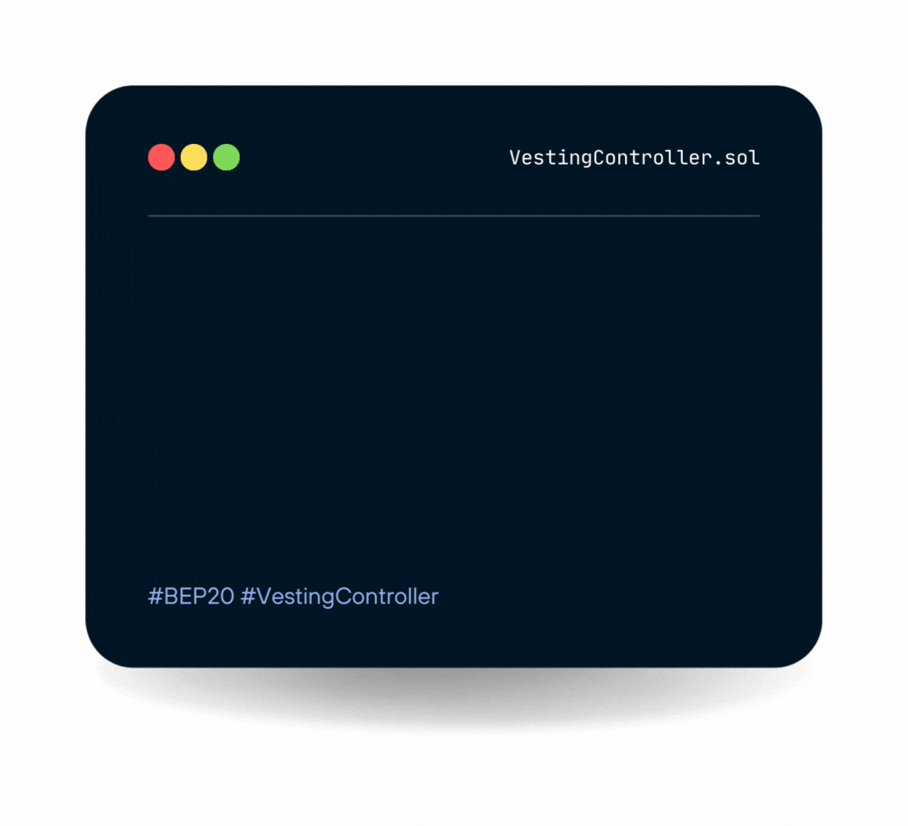

# Light node



### About the Vesting Controller Contract

A Vesting Controller contract that can release its token balance gradually like a typical vesting scheme, with a cliff and vesting period. Optionally revocable by the owner.

### The Characteristics

* [x] Get funded by the [MainContract.sol](overview.md#about-the-main-contract) contract
* [x] Able to set up multiple individual vesting schedules
* [x] Solidity best practices
* [x] Binance verified contracts

### Core: VestingController (VestingController.sol)

<mark style="color:blue;">**Modifiers:**</mark>

* [onlyOwner()](light-node.md#onlyowner)

<mark style="color:blue;">**Functions:**</mark>

* [constructor (beneficiary, start, cliffDuration, duration, revocable)](light-node.md#constructor-address-beneficiary-uint256-start-uint256-cliffduration-uint256-duration-bool-revocable)
* [beneficiary()](light-node.md#beneficiary-address)
* [cliff()](light-node.md#cliff-uint256)
* [start()](light-node.md#start-uint256)
* [duration()](light-node.md#duration-uint256)
* [revocable()](light-node.md#revocable-bool)
* [released(token)](light-node.md#released-address-token-uint256)
* [revoked(token)](light-node.md#revoked-address-token-bool)
* [release(token)](light-node.md#release-contract-ibep20-token)
* [revoke(token)](light-node.md#revoke-contract-ierc20-token)
* [owner()](light-node.md#owner-address)
* [isOwner()](light-node.md#isowner-bool)
* [renounceOwnership()](light-node.md#renounceownership)
* [transferOwnership(newOwner)](light-node.md#transferownership-address-newowner)

<mark style="color:blue;">**Events:**</mark>

* [TokensReleased(token, amount)](light-node.md#undefined)
* [TokensVestingRevoked(token)](light-node.md#undefined-1)
* [OwnershipTransferred(previousOwner, newOwner)](light-node.md#undefined-2)

<details>

<summary>onlyOwner()</summary>

Throws if called by any account other than the owner.

</details>

<details>

<summary>constructor(address beneficiary, uint256 start, uint256 cliffDuration, uint256 duration, bool revocable)</summary>

Creates a vesting contract that vests its balance of any ERC20 token to the beneficiary, gradually in a linear fashion until start + duration. By then all of the balance will have vested.

</details>

<details>

<summary>beneficiary() → address</summary>


</details>

<details>

<summary>cliff() → uint256</summary>


</details>

<details>

<summary>start() → uint256</summary>


</details>

<details>

<summary>duration() → uint256</summary>


</details>

<details>

<summary>revocable() → bool</summary>


</details>

<details>

<summary>released(address token) → uint256</summary>


</details>

<details>

<summary>revoked(address token) → bool</summary>


</details>

<details>

<summary>release(contract IBEP20 token)</summary>


</details>

<details>

<summary>revoke(contract IERC20 token)</summary>


</details>

<details>

<summary>owner() → address</summary>

Returns the address of the current owner.

</details>

<details>

<summary>isOwner() → bool</summary>

Returns true if the caller is the current owner.

</details>

<details>

<summary>renounceOwnership()</summary>


</details>

<details>

<summary>transferOwnership(address newOwner)</summary>

Transfers ownership of the contract to a new account (`newOwner`). Can only be called by the current owner.

</details>

<details>

<summary>TokensReleased(address token, uint256 amount)</summary>


</details>

<details>

<summary>TokenVestingRevoked(address token)</summary>


</details>

<details>

<summary>OwnershipTransferred(address previousOwner, address newOwner)</summary>


</details>

#### Imported & Utils Contracts

```solidity
import "./MainContract.sol";
import "@openzeppelin/contracts/access/Ownable.sol";
import "@openzeppelin/contracts/utils/math/Math.sol";
import "@openzeppelin/contracts/utils/math/SafeMath.sol";
```
