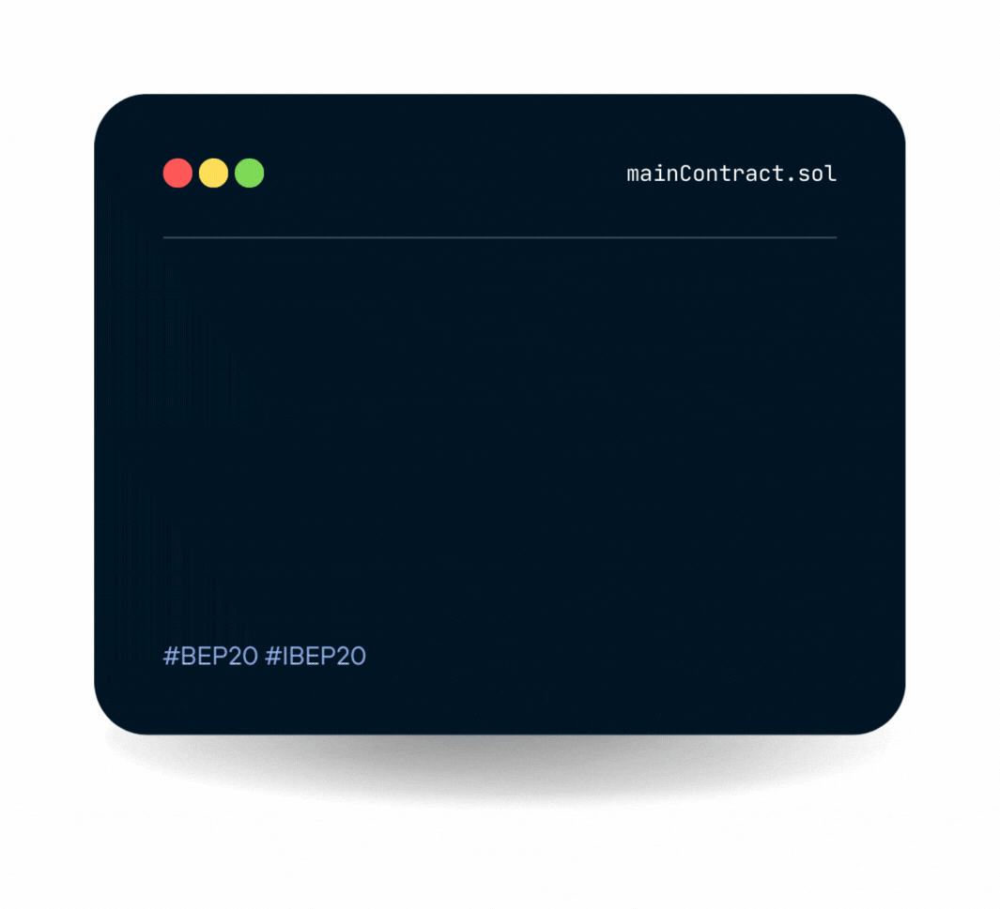

# Main Contract



### About the Main Contract

We have followed general OpenZeppelin guidelines: functions revert instead of returning `false` on failure. This behavior is nonetheless conventional and does not conflict with the expectations of ERC20 applications.

Additionally, an [`Approval`](https://docs.openzeppelin.com/contracts/2.x/api/token/erc20#IERC20-Approval-address-address-uint256-) event is emitted on calls to [`transferFrom`](https://docs.openzeppelin.com/contracts/2.x/api/token/erc20#ERC20-transferFrom-address-address-uint256-). This allows applications to reconstruct the allowance for all accounts just by listening to said events. Other implementations of the EIP may not emit these events, as it isn’t required by the specification.

Finally, the non-standard [`decreaseAllowance`](https://docs.openzeppelin.com/contracts/2.x/api/token/erc20#ERC20-decreaseAllowance-address-uint256-) and [`increaseAllowance`](https://docs.openzeppelin.com/contracts/2.x/api/token/erc20#ERC20-increaseAllowance-address-uint256-) functions have been added to mitigate the well-known issues around setting allowances. See [`IERC20.approve`](https://docs.openzeppelin.com/contracts/2.x/api/token/erc20#IERC20-approve-address-uint256-).

### The Characteristics

* [x] BEP20 standard that implements the interface IBEP20
* [x] Upgradeable contract using initializers​
* [x] Solidity best practices
* [x] Binance verified contracts


I have followed general OpenZepellin guidelines to build the contracts.


### Core: MainContract (MainContract.sol)

<mark style="color:blue;">**Functions:**</mark>

* constructor(name, symbol, decimals, address owner)
* [name()](overview.md#name-string)
* [symbol()](overview.md#symbol-string)
* [decimals()](overview.md#decimals-uint8)
* [totalSupply()](overview.md#undefined)
* [balanceOf(account)](overview.md#undefined-1)
* [getOwner()](overview.md#undefined-2)
* [transfer(to, amount)](overview.md#transferfrom-address-from-address-to-uint256-amount-bool)
* [transferFrom(from, to, amount)](overview.md#undefined)
* [approve(spender, amount)](overview.md#undefined-1)
* [alllowance(owner, spender)](overview.md#undefined-2)
* initialize(name, symbol, decimals, address owner)

<mark style="color:blue;">**Events:**</mark>

* [Transfer()](overview.md#transfer-address-from-address-to-uint256-value)
* [Approval()](overview.md#approval-address-owner-address-spender-uint256-value)

<details>

<summary>name () → string</summary>

Returns the name of the token - e.g. "MyToken".

</details>

<details>

<summary>symbol () → string </summary>

Returns the symbol of the token, usually a shorter version of the name.

</details>

<details>

<summary>decimals () → uint8</summary>

Returns the number of decimals used to get its user representation. For example, if `decimals` equals `2`, a balance of `505` tokens should be displayed to a user as `5.05` (`505 / 10 ** 2`).

Tokens usually opt for a value of 18, imitating the relationship between Ether and Wei. This is the value [`ERC20`](https://docs.openzeppelin.com/contracts/4.x/api/token/erc20#ERC20) uses, unless this function is overridden.

</details>

<details>

<summary>totalSupply () → uint256</summary>


</details>

<details>

<summary>balanceOf (address account) → uint256</summary>

See [`IERC20.balanceOf`](https://docs.openzeppelin.com/contracts/4.x/api/token/erc20#IERC20-balanceOf-address-).

</details>

<details>

<summary>getOwner () → uint256</summary>

Returns the bep20 token owner which is necessary for binding with bep2 token.

</details>

<details>

<summary>transfer (address to, uint256 amount) → bool</summary>

Moves `amount` tokens from the caller’s account to `to`.

Returns a boolean value indicating whether the operation succeeded.

Emits a [`Transfer`](https://docs.openzeppelin.com/contracts/4.x/api/token/erc20#IERC20-Transfer-address-address-uint256-) event.

</details>

<details>

<summary>transferFrom (address from, address to, uint256 amount) → bool</summary>

Emits an [`Approval`](https://docs.openzeppelin.com/contracts/4.x/api/token/erc20#IERC20-Approval-address-address-uint256-) event indicating the updated allowance. This is not required by the EIP. See the note at the beginning of [`ERC20`](https://docs.openzeppelin.com/contracts/4.x/api/token/erc20#ERC20).

</details>

<details>

<summary>approve (address spender, uint256 amount) → bool</summary>

If `amount` is the maximum `uint256`, the allowance is not updated on `transferFrom`. This is semantically equivalent to an infinite approval.

</details>

<details>

<summary>allowance (address owner, address spender) → uint256</summary>

See [`IERC20.allowance`](https://docs.openzeppelin.com/contracts/4.x/api/token/erc20#IERC20-allowance-address-address-).

</details>

<details>

<summary>Transfer (address from, address to, uint256 value)</summary>

Emitted when `value` tokens are moved from one account (`from`) to another (`to`).

Note that `value` may be zero.

</details>

<details>

<summary>Approval (address owner, address spender, uint256 value)</summary>

Emitted when the allowance of a `spender` for an `owner` is set by a call to [`approve`](https://docs.openzeppelin.com/contracts/4.x/api/token/erc20#IERC20-approve-address-uint256-). `value` is the new allowance.

</details>

### Interface: IBEP20 (IBEP20.sol)

<mark style="color:blue;">**Functions:**</mark>

* totalSupply()
* decimals()
* symbol()
* name()
* getOwner()
* balanceOf()
* transfer()
* allowance()
* approve()
* transferFrom()

<mark style="color:blue;">**Events:**</mark>

* Transfer()
* Approval()

<details>

<summary>totalSupply() → uint256</summary>

Returns the amount of tokens in existence.

</details>

<details>

<summary>decimals() → uint8</summary>

Returns the decimals

</details>

<details>

<summary>symbol() →string</summary>


</details>

<details>

<summary>name() →string</summary>


</details>

<details>

<summary>getOwner(address) → uint256</summary>


</details>

<details>

<summary>balanceOf(address account) → uint256</summary>

Returns the amount of tokens owned by account.

</details>

<details>

<summary>transfer(address recipient, uint256 amount) → bool</summary>

Moves `amount` tokens from the caller’s account to `recipient`.

Returns a boolean value indicating whether the operation succeeded.

Emits a [`Transfer`](https://docs.openzeppelin.com/contracts/2.x/api/token/erc20#IERC20-Transfer-address-address-uint256-) event.

</details>

<details>

<summary>allowance(address owner, address spender) → uint256</summary>

Returns the remaining number of tokens that `spender` will be allowed to spend on behalf of `owner` through [`transferFrom`](https://docs.openzeppelin.com/contracts/2.x/api/token/erc20#IERC20-transferFrom-address-address-uint256-). This is zero by default.

This value changes when [`approve`](https://docs.openzeppelin.com/contracts/2.x/api/token/erc20#IERC20-approve-address-uint256-) or [`transferFrom`](https://docs.openzeppelin.com/contracts/2.x/api/token/erc20#IERC20-transferFrom-address-address-uint256-) are called.

</details>

<details>

<summary>approve(address spender, uint256 amount) → bool</summary>

Sets `amount` as the allowance of `spender` over the caller’s tokens.

Returns a boolean value indicating whether the operation succeeded.

</details>

<details>

<summary>transferFrom(address sender, address recipient, uint256 amount) → bool</summary>

Moves `amount` tokens from `sender` to `recipient` using the allowance mechanism. `amount` is then deducted from the caller’s allowance.

Returns a boolean value indicating whether the operation succeeded.

Emits a [`Transfer`](https://docs.openzeppelin.com/contracts/2.x/api/token/erc20#IERC20-Transfer-address-address-uint256-) event.

</details>

<details>

<summary>Transfer(address from, address to, uint256 value)</summary>

Emitted when `value` tokens are moved from one account (`from`) to another (`to`).

Note that `value` may be zero.

</details>

<details>

<summary>Approval(address owner, address spender, uint256 value)</summary>

Emitted when the allowance of a `spender` for an `owner` is set by a call to [`approve`](https://docs.openzeppelin.com/contracts/2.x/api/token/erc20#IERC20-approve-address-uint256-). `value` is the new allowance.

</details>

### Utils Contracts

```solidity
import "@openzeppelin/contracts/proxy/TransparentUpgradeableProxy.sol";
import "@openzeppelin/contracts/utils/math/SafeMath.sol";
import "@openzeppelin/contracts/access/Ownable.sol";
import "@openzeppelin/contracts/utils/Context.sol";
```
