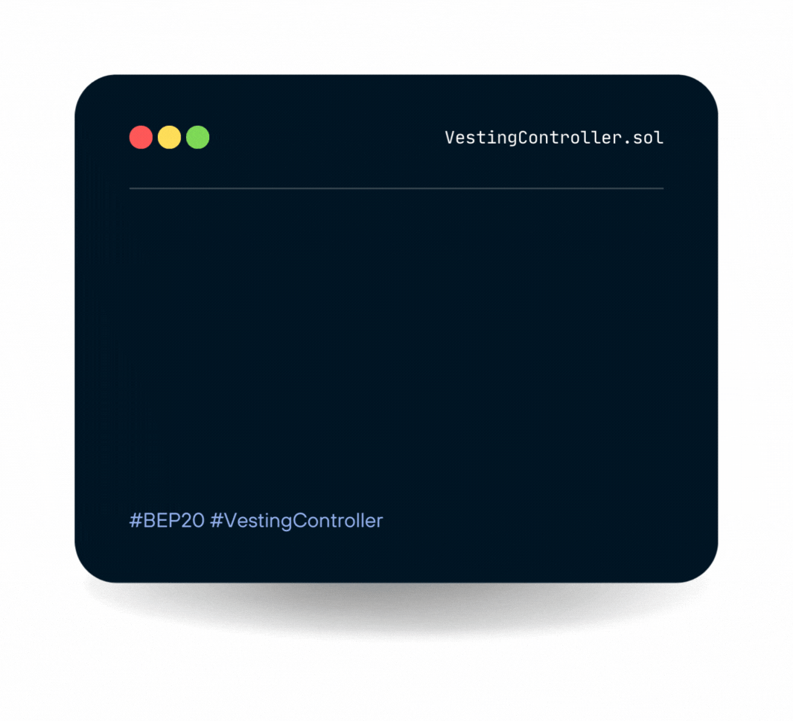

# Vesting Controller Contract

### About the Vesting Controller Contract

We have followed general OpenZeppelin guidelines: functions revert instead of returning `false` on failure. This behavior is nonetheless conventional and does not conflict with the expectations of ERC20 applications.

Additionally, an [`Approval`](https://docs.openzeppelin.com/contracts/2.x/api/token/erc20#IERC20-Approval-address-address-uint256-) event is emitted on calls to [`transferFrom`](https://docs.openzeppelin.com/contracts/2.x/api/token/erc20#ERC20-transferFrom-address-address-uint256-). This allows applications to reconstruct the allowance for all accounts just by listening to said events. Other implementations of the EIP may not emit these events, as it isn’t required by the specification.

Finally, the non-standard [`decreaseAllowance`](https://docs.openzeppelin.com/contracts/2.x/api/token/erc20#ERC20-decreaseAllowance-address-uint256-) and [`increaseAllowance`](https://docs.openzeppelin.com/contracts/2.x/api/token/erc20#ERC20-increaseAllowance-address-uint256-) functions have been added to mitigate the well-known issues around setting allowances. See [`IERC20.approve`](https://docs.openzeppelin.com/contracts/2.x/api/token/erc20#IERC20-approve-address-uint256-).

### The Characteristics

* [x] Easy to use by other developers
* [x] Adds a lot functionality and value to apps
* [x] Does not negatively impact a mobile device’s CPU, battery, or data consumption
* [x] Plays well with other SDKs


I have followed general OpenZepellin guidelines to build the contracts.


### Core: VestingController (VestingController.sol)

<mark style="color:blue;">**Modifiers:**</mark>

* onlyOwner()

<mark style="color:blue;">**Functions:**</mark>

* constructor (beneficiary, start, cliffDuration, duration, revocable)
* beneficiary()
* cliff()
* start()
* duration()
* revocable()
* released(token)
* revoked(token)
* release(token)
* revoke(token)
* owner()
* isOwner()
* renounceOwnership()
* transferOwnership(newOwner)

<mark style="color:blue;">**Events:**</mark>

* TokensReleased(token, amount)
* TokensVestingRevoked(token)
* OwnershipTransferred(previousOwner, newOwner)

onlyOwner()

Throws if called by any account other than the owner.

constructor(address beneficiary, uint256 start, uint256 cliffDuration, uint256 duration, bool revocable)

Creates a vesting contract that vests its balance of any ERC20 token to the beneficiary, gradually in a linear fashion until start + duration. By then all of the balance will have vested.

beneficiary() → address

cliff() → uint256

start() → uint256

duration() → uint256

revocable() → bool

released(address token) → uint256

revoked(address token) → bool

release(contract IBEP20 token)

revoke(contract IERC20 token)

owner() → address

Returns the address of the current owner.

isOwner() → bool

Returns true if the caller is the current owner.

renounceOwnership()

transferOwnership(address newOwner)

Transfers ownership of the contract to a new account (`newOwner`). Can only be called by the current owner.

